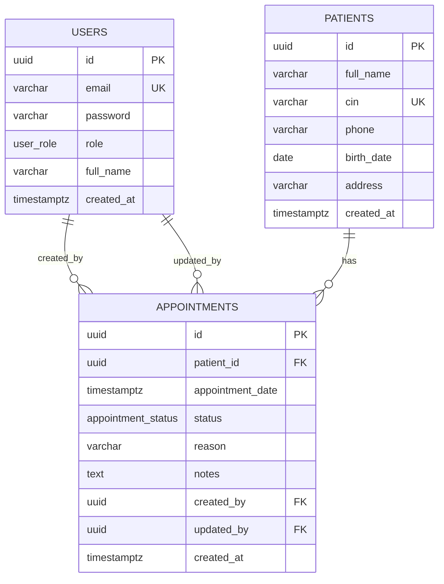

# ERD - ClinicFlow

## Relations et justification

### `patients` → `appointments` : relation 1-N
- Un patient peut avoir **plusieurs** rendez-vous.
- Un rendez-vous appartient à **un seul** patient.
- FK : `appointments.patient_id → patients.id`
- **ON DELETE CASCADE** : lorsqu'un patient est supprimé, ses rendez-vous sont supprimés automatiquement (le service `deletePatient` supprime d'abord les RDV liés puis le patient, en cohérence avec la contrainte).

### `users` → `appointments` (created_by) : relation 1-N
- Un utilisateur (admin ou staff) peut créer **plusieurs** rendez-vous.
- Un rendez-vous a **un seul** créateur.
- FK : `appointments.created_by → users.id`
- **ON DELETE RESTRICT** : on empêche la suppression d'un utilisateur qui a créé des rendez-vous, afin de préserver la traçabilité.

### `users` → `appointments` (updated_by) : relation 1-N optionnelle
- Un utilisateur peut modifier **plusieurs** rendez-vous.
- Un rendez-vous peut avoir **0 ou 1** dernier modificateur.
- FK : `appointments.updated_by → users.id`
- **ON DELETE SET NULL** : si l'utilisateur est supprimé, le rendez-vous est conservé mais la référence du modificateur est mise à NULL.

### Absence de relation N-N
Il n'y a **aucune relation many-to-many** dans ce modèle. Aucune table de jointure n'est nécessaire.

## Contraintes

- **UUID** en clé primaire partout (`gen_random_uuid()` via l'extension `pgcrypto`), pour éviter les entiers incrémentaux et faciliter le découplage.
- **UNIQUE** sur `users.email` et `patients.cin` pour éviter les doublons.
- **ENUM Postgres** : `user_role` (`admin`, `staff`) et `appointment_status` (`pending`, `confirmed`, `cancelled`).
- **CHECK** redondant sur `appointments.status` pour garantir des valeurs cohérentes même hors ENUM.
- **NOT NULL** sur tous les champs métier obligatoires.

## Index et performance

| Index | Table | Colonnes | Justification |
|---|---|---|---|
| idx_users_email | users | email | Login rapide |
| idx_users_role | users | role | Filtrage par rôle |
| idx_patients_full_name | patients | full_name | Recherche par nom |
| idx_patients_cin | patients | cin | Recherche par CIN |
| idx_patients_phone | patients | phone | Recherche par téléphone |
| idx_appointments_patient_date | appointments | (patient_id, appointment_date) | **Détection du conflit de 30 minutes** |
| idx_appointments_date_status | appointments | (appointment_date, status) | Filtres liste + dashboard |
| idx_appointments_status | appointments | status | Comptage pending / confirmed |

## Règle métier : fenêtre de 30 minutes

> Un patient ne peut pas avoir **2 rendez-vous confirmés** dans une fenêtre de 30 minutes.

- Vérification côté **service** (`appointment.service.js`) avant tout `INSERT` ou `UPDATE` vers `confirmed`.
- Requête SQL : `SELECT ... WHERE patient_id = $1 AND status = 'confirmed' AND appointment_date BETWEEN (date - 30min) AND (date + 30min)`.
- Index composite `(patient_id, appointment_date)` utilisé pour la performance.